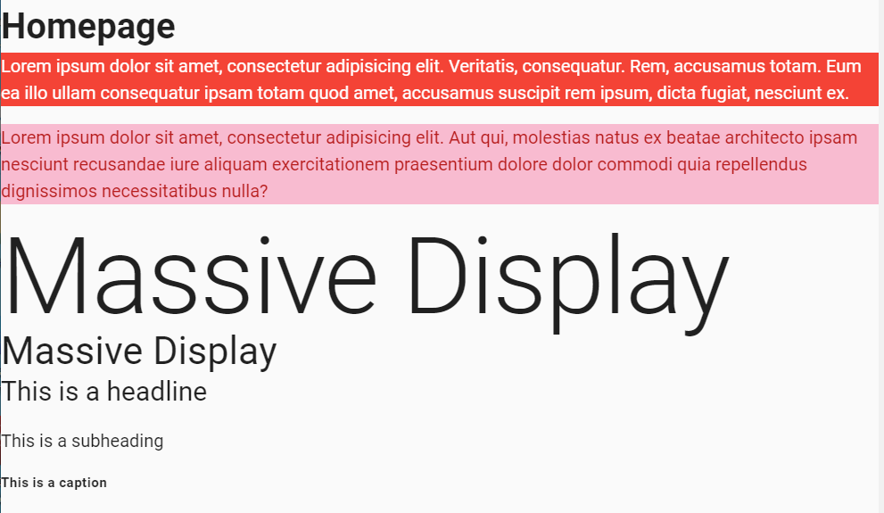
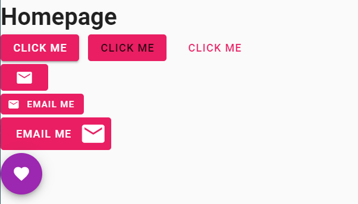
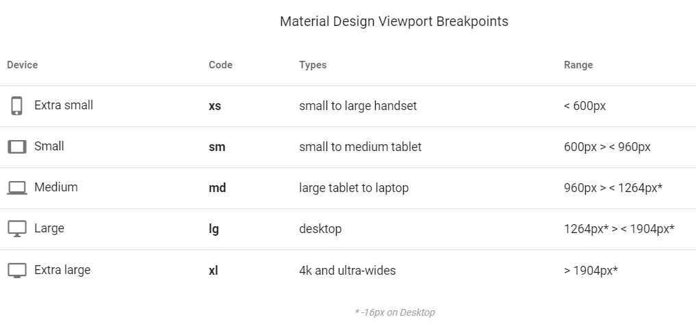
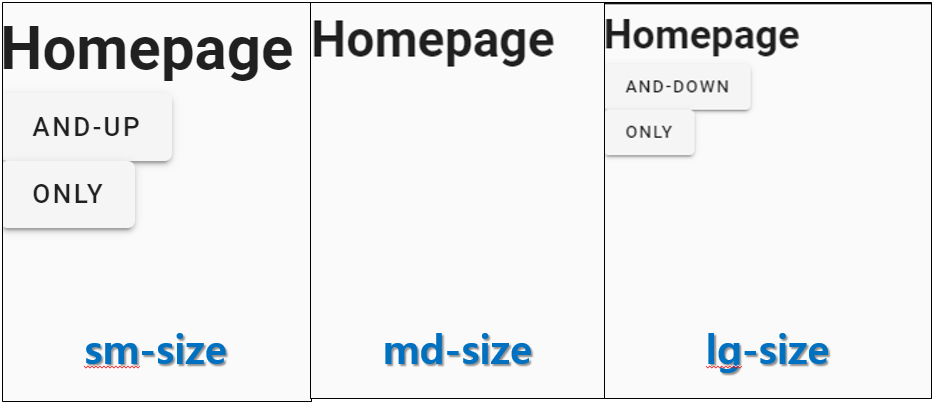
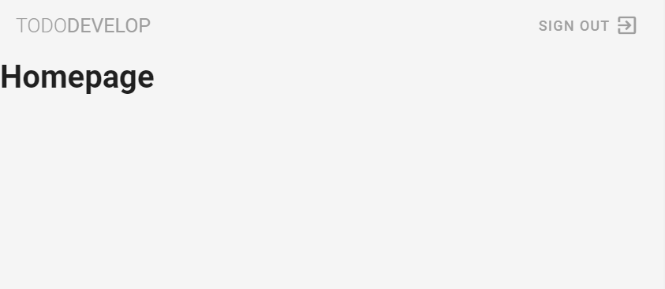
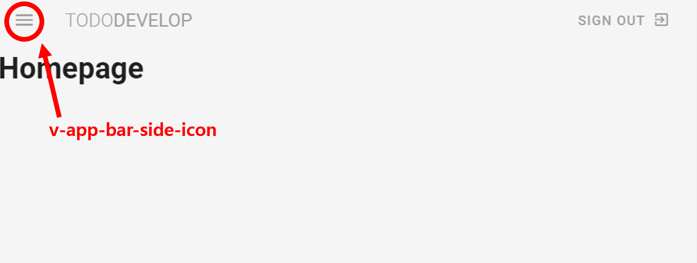
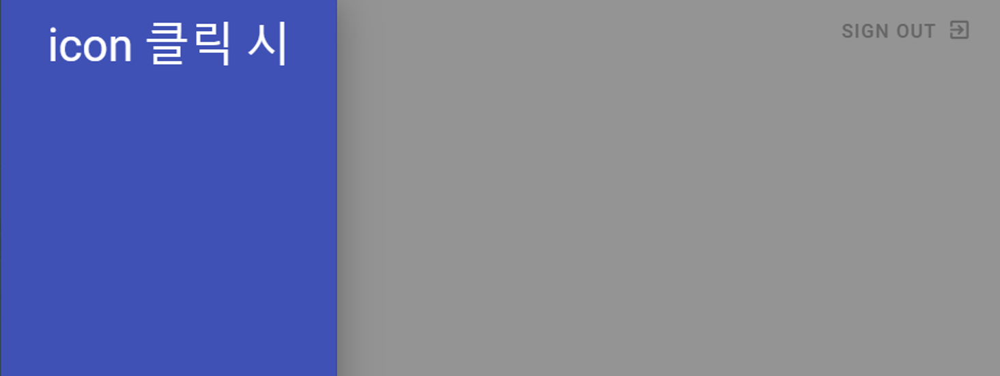

# Vuetify

> - Vue를 커스터마이징 하는데 있어 최적화 된 framework
>
> - Vuetify 공식홈페이지 (https://vuetifyjs.com/)
>
> - 참고 영상 (https://www.youtube.com/playlist?list=PL4cUxeGkcC9g0MQZfHwKcuB0Yswgb3gA5)

---

## \<Index>

1. Vue - Review (Vue CLI install, setting)
2. Vuetify - Install
3. Vuetify - Basic
4. Vuetify - Text & Colours
5. Vuetify - Button & Icons
6. Vuetify - Breakpoints & Visibility
7. Vuetify - Toolbars & Navigation Drawers

---

## \<History>

- 2020.01.17 - [edit index - 1, 2, 3, 4, 5] & [add index - 6, 7]

- 2020.01.16 - [create document] & [add index - 1, 2, 3, 4, 5]

---

### 1. Vue - Review (Vue CLI install, setting)

>  CLI 를 이용해 vue 개발 환경 구축하기

- Vue CLI 설치 및 프로젝트 생성

  - __`$ npm i -g @vue/cli`__ : vue-cli 설치
  - __`$ vue create 프로젝트이름`__ : 새로운 프로젝트 생성
       - (create 명령어 입력후 Vue에 대해 아무것도 기억나지 않을 경우 아래와 같이 만들자)
         - `> Manually select features` 선택
         - `Babel, Router, Linter / Formatter` 체크(spacebar) 후 선택(enter)
            - `Use history mode for router?(Y/n)` => Y
            - `Pick a linter / formatter config:` => `ESLint with error prevention only`
            - `Pick additional lint features:` => `Lint on save`
            - `Where do you prefer placing config for Babel, ESLint, etc.?` => `> In package.json`
         			- `Save this as a preset for future projects?(y/N)` => N

  - __`$ npm run serve`__ : 실행 명령어

---

### 2. Vuetify  - Install

- Vuetify 설치하기
  - __`$ vue add vuetify`__ 입력 후 __`> Default`__ 선택
  - `src/plugins/vuetify.js` 폴더가 추가된 것을 확인
- 5. Vuetify - Button & Icons 에서 `<v-icon>`에 MATERIAL DESIGN의 ICON 이 바로 적용되게 하기 위한 설정

  - __`$ npm install --save material-design-icons-iconfont`__: MATERIAL DESIGN ICON 설치

  - `src/plugins/vuetify.js` 파일에 아래와 같이 __코드 추가__

    ```js
    // vuetify.js
    import 'material-design-icons-iconfont/dist/material-design-icons.css' // +
    import Vue from 'vue';
    import Vuetify from 'vuetify/lib';
    
    Vue.use(Vuetify);
    
    export default new Vuetify({
        icons: {			// +
            iconfont: 'md',	 // +
        },				   // +
    });
    ```

    

---

### 3. Vuetify - Basic

> Vuetify 는 UI component framework 이다.

- __`v-app`__ : Vuetify의 root component 로 'v-' 로 시작하는 vuetify의 모든 component는 v-app 안에서만 사용 할 수 있다.(아래에서 간단하게 그 사용예시를 살펴보자.)

  ```vue
  <!-- 기본적인 사용 방법 -->
  <template>
  	<v-app> <!-- v-app 태그 안에 v- 로 시작하는 태그들을 사용할 수 있다. -->
          <v-toolbar app height="150"> <!-- 원하는 속성들을 옆에 사용, 띄어쓰기로 구분 -->
              <span>Vuetify</span>
              <span class="font-weight-light">MATERIAL DESIGN</span>
      	</v-toolbar>
      </v-app>
  </template>
  ```

---

### 4. Vuetify - Text & Colours

- __배경색 변경__: class 에 '색상'   ex) __`<p class="red>bg color</p>"`__
- __글자색 변경__: class 에 '색상--text'   ex) __`<p class="white--text>text color</p>"`__
- __배경색상톤 조절__: class 에 배경색 변경 후 'lighten-1~4' 또는 'darken-1~4'   ex) __`<p class=pink lighten-4>bg color tone</p>`__
- __글자색상톤 조절__: class 에 글자색 변경 후 'lighten-1~4' 또는 'darken-1~4'  ex) __`<p class=red--text text--darken-4>text color tone</p>`__
- __글자크기 조절__:
  - class 에 'display-1(L)~4(S)'  ex) __`<h1 class="display-1>Display1</h1>"`__
  - class 에 'headline, subtitle, caption' 등 표현 용도를 입력  ex) __`<p class="headline>headline</p>"`__
- __글자스타일 조절__: class 에  'font-weight-원하는스타일' 또듣 'font-italic' 입력  ex) __`<p class="font-weight-bold">font weight bold</p>`__


- 적용해 보기

  - `src/App.vue` 파일을 열어 기본으로 생성된 코드를 아래와 같이 수정

    ```vue
    <!-- App.vue -->
    <template>
    	<v-app>
            <v-content>
                <router-view></router-view>
        	</v-content>
        </v-app>
    </template>
    
    <script>
    export default {
        name: 'App',
    }
    </script>
    ```

    

  - `src/views/Home.vue` 파일에 아래와 같이 코드 작성

    ```vue
    <!-- Home.vue -->
    <template>
      <div class="home">
        <h1>Homepage</h1>
        <!-- 배경색, 글자색 변경-->
        <p class="red white--text">Lorem ipsum dolor sit amet, consectetur adipisicing elit. Veritatis, consequatur. Rem, accusamus totam. Eum ea illo ullam consequatur ipsam totam quod amet, accusamus suscipit rem ipsum, dicta fugiat, nesciunt ex.</p>
        <!-- 배경색상톤, 글자색상톤 조절 -->
        <p class="pink lighten-4 red--text text--darken-4">Lorem ipsum dolor sit amet, consectetur adipisicing elit. Aut qui, molestias natus ex beatae architecto ipsam nesciunt recusandae iure aliquam exercitationem praesentium dolore dolor commodi quia repellendus dignissimos necessitatibus nulla?</p>
        <!-- 글자크기 조절 -->
        <h1 class="display-4">Massive Display</h1>
        <h4 class="display-1">Massive Display</h4>
        <p class="headline">This is a headline</p>
        <p class="subheading">This is a subheading</p>
        <!-- 글자스타일 조절 -->
        <p class="caption font-weight-bold">This is a caption</p>
      </div>
    </template>
    
    <script>
    // @ is an alias to /src
    
    export default {
      name: 'home',
    }
    </script>
    ```
  
 - 실행화면
  
     

---

### 5. Vuetify - Button & Icons

- __`<v-btn>`__ : vuetify에서 제공하는 button component
  - __버튼색, 버튼 안의 글자색 변경__:
    - 'v-' 로 시작하는 태그는 속성으로 원하는 색상을 입력해 미리 설정되어 있는 배경색과 글자색으로 조절 가능  ex) __`<v-btn dark>버튼</v-btn>`__
    - v-btn 태그의 class에 배경색과 글자색 입력  ex) __`<v-btn class="pink white--text">버튼</v-btn>`__
    - class 대신 color 속성으로 배경색 적용 가능하며 원하는 색상을 입력시 해당하는 글자색만 적용시킬 수 있다.  ex) __`<v-btn dark color="pink">버튼</v-btn>`__ => 바로 위의 예시와 같은 모양의 버튼 생성
  - __버튼 그림자 효과 없애기__: v-btn 태그 안에 depressed 속성 주기  ex) __`<v-btn depressed color="pink">버튼</v-btn>`__
  - __버튼의 아웃트라인 없애기__:
    - v-btn 태그에 text 속성 주기  ex) __`<v-btn text color="pink">버튼</v-btn>`__
    - vuetify@2.1.13 이전 버전에서는 'text -> flat' 속성
  - __버튼 모양 변경__: v-btn 태그에 FAB, ROUNDED 속성 적용  ex) __`<v-btn fab>버튼</v-btn>`__
- __`<v-icon>`__: MATERIAL DESIGN이 적용된 아이콘을 바로 사용가능하게 해준다.
  - __아이콘 사용__: v-icon 태그에 MATERIAL DESIGN 에서 정의된 아이콘 이름 사용  ex) __`<v-icon>email</v-icon>`__
  - MATERIAL DESIGN 공식 사이트: __https://material.io/resources/icons/?style=baseline__
- __사이즈 및 위치 조절__:
  - 태그 안에 large, small 등의 속성을 적용해 사이즈 조절  ex) __`<v-btn large class="pink white--text">버튼</v-btn>`__ or __`<v-icon large>email</v-icon>`__
  - 태그 안에 left, right 등의 속성을 적용해 위치 조절 ex)  __`<v-icon left>email</v-icon>`__


- 적용해 보기

  - `src/views/Home.vue` 파일에 아래와 같이 코드 작성

    ```vue
    <template>
      <div class="home">
        <h1>Homepage</h1>
        <!-- 버튼색, 글자색, 효과 변경 -->
        <v-btn class="pink white--text mr-3">click me</v-btn>
        <v-btn depressed color="pink mr-3">click me</v-btn>
        <v-btn text color="pink" class="mr-3">click me</v-btn>
        <!-- 아이콘 사용, 위치, 사이즈 변경 -->
        <div>
          <v-btn depressed class="pink white--text my-1">
            <v-icon>email</v-icon>
          </v-btn>
        </div>
        <div>
          <v-btn text small class="pink white--text">
            <v-icon small left>email</v-icon>
            <span>email me</span>
          </v-btn>
        </div>
        <div>
          <v-btn text large class="pink white--text my-1">
            <span class=" mr-3">email me</span>
            <v-icon large right>email</v-icon>
          </v-btn>
        </div>
        <!-- 버튼 모양 변경 -->
        <v-btn fab dark class="purple mr-3">
          <v-icon>favorite</v-icon>
        </v-btn>
      </div>
    </template>
    
    <script>
    // @ is an alias to /src
    
    export default {
      name: 'home',
    }
    </script>
    ```

  - 적용화면

    

---

### 6. Vuetify - Breakpoints & Visibility

> - 사용자의 화면 크기에 따라 동적으로 변하는 페이지를 만들기 위해 정해주는 속성(bootstrat의  그리드 시스템 기능)

- __Breakpoints__:

  

- __Condition__: 보여주는 기준을 설정
  - __only__: 해당하는 조건만
  - __and-down__: 해당 조건 이하
  - __and-up__: 해당 조건 이상
- __Visibility__: breakpoints 와 condition을 사용해 언제 보여줄지 또는 안보여줄지 결정
  - __기본 형식__: __`hidden-{breakpoint}-{condition}`__
  - ex) __`<v-btn class="hidden-md-and-up">and-up</v-btn>`__


- 적용해 보기

  - `src/views/Home.vue` 파일에 아래와 같이 코드 작성

    ```vue
    <template>
      <div class="home">
        <h1>Homepage</h1>
        <div>
          <!-- md 이하 사이즈에서는 사라짐 -->
          <v-btn class="hidden-md-and-down">and-down</v-btn>
        </div>
        <div>
          <!-- md 이상 사이즈에서는 사라짐 -->
          <v-btn class="hidden-md-and-up">and-up</v-btn>
        </div>
        <div>
          <!-- md 사이즈에서만 사라짐 -->
          <v-btn class="hidden-md-only">only</v-btn>
        </div>
      </div>
    </template>
    
    <script>
    // @ is an alias to /src
    
    export default {
      name: 'home',
    }
    </script>
    ```

  - 적용화면

    

---

### 7. Vuetify - Toolbars & Navigation Drawers

- __`<v-toolbar>`__: nav 태그 안에서 사용하는 컴포넌트로 navigation 을 편하게 커스터마이징 할 수 있음
  - __툴바의 그림자 없애기__: v-toolbar 태그에 flat 속성 추가  ex) __`<v-toolbar flat></v-toolbar>`__ 
  - __`<v-toolbar-title>`__: toolbar 의 타이틀을 입력
  - __`<v-spacer>`__: inline에서 속성들 간의 거리를 띄워주는 태그

- 적용해 보기

  - `src/components` 폴더 안에 `Navbar.vue` 파일 생성

    ```vue
    <template>
      <nav>
          <!-- toolbar 생성 및 타이틀 정해주기 -->
          <v-toolbar flat class="grey lighten-4">
            <v-toolbar-title class="text-uppercase grey--text">
                <span class="font-weight-light">Todo</span>
                <span>Develop</span>
            </v-toolbar-title>
            <!-- 버튼과 타이틀 사이 띄워주기 -->
            <v-spacer></v-spacer>
            <v-btn text color=grey>
                <span>Sign Out</span>
                <v-icon right>exit_to_app</v-icon>
            </v-btn>
          </v-toolbar>
      </nav>
    </template>
    
    <script>
    export default {
        name: 'Navbar',
    }
    </script>
    
    <style>
    
    </style>
    ```

  - 적용화면

    


- __`<v-navigation-drawer>`__:

  - 페이지의 네비게이션(원하는 곳으로 이동할 수 있도록 해주는 메뉴를 보여줌)

  - default가 false 이기 때문에 v-navigation-drawer 만 사용하면 아무런 변화가 없다.

  - __v-app 과 연결하기(필수)__: 네비게이션은 app이 아닌 특정 태그에 자식태그가 되어서는 안되기 때문에 root 인 v-app 과 연결해주기 위해 app 이라는 속성으르 사용한다.  ex) __`<v-navigation-drawer app></v-navigation-drawer>`__

  - __v-navigation-drawer 상태 조작(false <-> true)__:

    - 우선 vue의 v-model 속성을 사용해 사용자가 v-navigation-drawer 상태를 조작할 수 있도록 연결해 준다. 

    - drawer의 값을 default 값인 false로 초기화
    
      ```vue
      <template>
      	<nav>
              <v-navigation-drawer app v-model="drawer"></v-navigation-drawer>
          </nav>
      </template>
      
      <script>
          export default {
              name: 'Navbar',
              data() {
                  return {
                      drawer: false, // true로 초기화 하고 새로고침을 누르면 navigation이 동작하는 것을 확인 할 수 있다.
                  }
              },
          }
    </script>
      ```
    
    - __`<v-app-bar-nav-icon>`__: 편리하게 네비게이션 조작을 할 수 있도록 만들어진 메뉴 아이콘 모양 컴포넌트
    
      - v-on 속성을 이용해 이벤트 발생시 네이게이션에 연결된 drawer 값을 조작한다.
    
        ```vue
        <template>
        	<nav>
                <v-app-bar-nav-icon @click="drawer = !drawer"></v-app-bar-nav-icon> <!-- 클릭 이벤트 감지하는 토글 아이콘 -->
                <v-navigation-drawer app v-model="drawer"></v-navigation-drawer>
            </nav>
        </template>
        
        <script>
            export default {
                name: 'Navbar',
                data() {
                    return {
                        drawer: false,
                    }
                },
            }
        </script>
        ```
    
        


- 적용해 보기

  - 위에서 생성한 `src/components/Navbar.vue` 파일에 아래와 같이 코드를 추가해 준다.

    ```vue
    <template>
      <nav>
          <v-toolbar flat class="grey lighten-4">
            <!-- 네비게이션 조작하기 위한 icon 추가 -->
            <v-app-bar-nav-icon class="grey--text" @click="drawer = !drawer"></v-app-bar-nav-icon>
            <v-toolbar-title class="text-uppercase grey--text">
                <span class="font-weight-light">Todo</span>
                <span>Develop</span>
            </v-toolbar-title>
            <v-spacer></v-spacer>
            <v-btn text color=grey>
                <span>Sign Out</span>
                <v-icon right>exit_to_app</v-icon>
            </v-btn>
          </v-toolbar>
    	  <!-- 네비게이션 생성-->
          <v-navigation-drawer app v-model="drawer" class="indigo">
              <p class="display-1 white--text text-center mt-5">icon 클릭 시</p>
          </v-navigation-drawer>
      </nav>
    </template>
    
    <script>
    export default {
        name: 'Navbar',
        data() {
            return {
                drawer: false,
        }
        },
  }
    </script>
  
    <style>
  
    </style>
    ```
    
  - 적용화면
  
      - 클릭 전
  
        
  
    - 클릭 후
  
      

---

